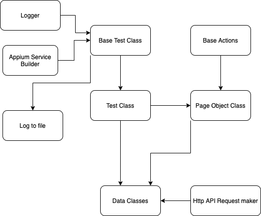

# theScore QA Automation Challenge Feb 2023
This repository hosts the project solution to theScore's QA Automation (Mobile) challenge.

Author | Aleem ul Haq
--- | ---
Date Completed| Feb 21, 2023

## Challenge requirements
Write an automated test that finds a league, team or a player within theScore app.

Automate the following steps:
1. Open a team page
2. Verify the expected page opens correctly
3. Tap on the team's stats sub-tab of the page opened from step 1
4. Verify the correct tab opens and data is displayed as expected
5. Verify back navigation returns you to the previous page correctly

## Prerequisites for running this project
Please make you satisfy the following requirements before building the project

**Environment** requirements and dependencies:
- JVM
- Android sdk tools, Android home and platform tools path should be set
- min Node version >= 12

Project level dependencies like below will install through gradle automatically 
- Latest Appium 2.0 and its java client 8.3.0
- Gson parsing lib 2.10
- Junit Parameterized lib 5.6.0
- etc..

## Android device requirements:
Currently, we are able to run the project against two kinds of devices:

#### Real device android phones
- Hardware android device connection to computer. MAKE SURE developer mode is enabled, and has settings accessible to webdriver
- If you have multiple hardware devices attached, adb will pick one.
- If you want to run tests on a specific hardware device, please make sure it is the only hardware Android device plugged in to the computer.

#### Android Emulators
- Only support **Pixel_6_API_33** specifically at the moment. This is done on purpose so we always have an emulator back up option that boots up.
- Make sure you have **Pixel_6_API_33** virtual device downloaded through Android sdk tools or Android studio device manager
#### Note about connected devices:
- The only virtual device that will run the tests is **Pixel_6_API_33**, make sure the AVD name matches that
- If a hardware device is connected, it will always be prioritized for testing

## Setup & Running tests
To build the project and executes tests, you just need to run the following command in the project path.
e.g:
- Set file path to access my project directory `cd.../../user/../../theScore-automation`,
- then run `./gradlew clean test`   (run clean, and build test tasks)
- After each successful test run, the sessions logs are saved in the `projDir/logs/` directory

## Automation Framework Structure
The automation framework is built open the following underlying structure

- The entry point of the application is **Base Test** class
- All setup utilities are initialized from the Base Test class
- All utilities are destructed in the Base Test class at the end of test execution
- **Test** classes inherit from Base Test class. This allows us to keep tests generic enough where we can support ios in the future with minimal changes. We can overwrite the driver options/capabilities according to the mobile OS, in test classes
- **Api Request maker** and **Data classes** work together to make efficient API class and cache results in the instance of data classes
- Kotlin data classes are great, already come equipped with equals() and toString() implementations, to make us write fast and easy to read and understand code. 
- Data classes are also unbothered by field order, giving us confidence in our tests' stability even when using dynamic API data
- Having **Page Object** classes also gives us the advantage of separating test and page object logic, making it easier to scale the testing framework without introducing fragility
- All Page Object classes are derived from a **Base Actions** class
- **Base Actions** class deals with all the appium api related to performing actions on the mobile UI. E.g scroll and find element until end of page. (Fun one to solve :D )
- **Logger** is extended to all classes, objects, companion objects to allow for specific, object context level logging
- The framework is designed to maintain uniform principles around abstraction, DRY, and functional ideas. Allowing us to build and scale cleanly and efficiently

## Test implementation
#### Launch app and go through onboarding to Favorites page
- Install theScore apk on an Android device and Launch app
- Navigate through **Onboarding** to get to the **Favorites** page

#### Get team profile data from theScore api
- Make a HTTP request to theScore api and grab the current team's profile api response. (Note, we are using JUNIT parameterized approach and will test several teams from different sports.)
- Parse the team profile api response and extract team full name, and team-stats from all possible seasons in the API Endpoint. (This is especially important because some soccer teams have multiple season stats and we scroll and verify through all that data)

#### Search for the team name using api data, navigate to team stats page
- We use the api response Full Team Name and search and open the team page
- Verify api data and UI elements and text match and are compatible
- Go to team stats page

#### Verify team stats page showing exactly the same data as API provides
- We first check if team stats tab is selected correctly
- Then verify all the data titles and values against the API
- Scroll team stats page, and verify all possible stats. Teams like soccer have multiple scrolls of Stats

#### Navigate back once, back to the Search view page
- When we navigate back once, we get to Search Page
- We verify search bar shows the cached text from our previous search result
- Navigate back again to Favorites page to support next parameterized run

#### Repeat steps for each parameter (Different league/sport's team)
- Once tests are concluded, we save test session logs to the `/logs` dir

## Rationale behind test approach
The approach was based around a Fans/Users first strategy, where I thought about the problem statement in the context of a regular user of theScore app. A regular user expects a user-friendly interface, with ability to quickly and reliably get access to the sports information they seek. In such case, I thought about a common user pattern where they might install the app, go through onboarding, search for a team and view the team stats.

 A team-stats page is data intensive, and has high impact to many sports users. Due to such, we have to verify the data displayed on the mobile UI is exactly as expected. This is usually a trivial testing paradigm in backend development, where we can quickly unit-test the api and data.
 But we also regularly see UI bugs that show data incorrectly, even when the API is healthy.

Verifying the data itself on the UI level was challenging. Especially since, without developer or android root level access, I was unlikely to read any API calls.
I thought about some public apis that might provide sports stats and info, but there is no gaurantee that that provider will match with theScore api info.

Eventually I came across theScore website, although qute limited in functionality, the website shows Team page views, and team-stats pages.
Having the website render this information meant, I can listen into the network traffic in the browser dev tools.
After investigating further, I managed to discover some public theScore api endpoints. I used these endpoints to give me information about team names, standings, header texts etc.

Although we can talk about calling the API in a UI test can bring some level of instability, the tests will continue to provide value until the api changes.
 
Kotlin data classes also provide a great way to map all that data using GSON to kotlin object. I cached those objects as well so I can quickly and reliable access any API data values, without slowing down or disrupting the UI test

## Coverage assessment of feature
Although this particular test navigates through onboarding and search to the team page, the objective of the test is to verify the team stats

The tests focus on the following requirements:
1) Teams that have a team-stats, shows stats tab on team page
2) Checks team api data and UI team name, UI data values are correct
3) Back navigation works

#### Further test scenarios
However, I just covered one way of getting to a teams page.

The project solution can be expanded to cover more test scenarios:
- User logs in, then navigates to team page
- Already logged in user navigates to team page
- Search for a team
- Clicking on a team chip or team element in (leagues, matches, favorites, standings pages etc.)
- Test for a team that does not have stats, and is expected not to show stats tab
- Open team page from mobile app widgets

#### Improvements, upgrades, todos
- Failure image screenshot for each any test failures. Very helpful in debugging
- Abstract the appium driver logic out of test classes, so that we can add IOS to the project as well, without having to write any new setup code
- Project directory structure, better approach to how to design classes, and where to use functional code instead of better performance
- Github actions, static analysis tools. Appium testing on remote devices/farms
- Explore more of the new Appium 2.0 API. Promising image/visual automation
- Add http listener to listen to logs on remote port, send logs to cloud platforms
- More debugging tools ADB library instead of shell command relying on an active shell/terminal processes

## Known issues
- theScore Technical Issue popup can be unexpected. I have added an explicit condition to deal with this
- Every 1 in 20 test runs, I notice Appium intermingling the values of web elements when scrolling. Could be a appium 2.0 related issue since its still in beta.
- I tried to cover most error/exception handling cases I can think of, but its possible to run into some unexpected exceptions from driver misbehaving 

## Fun things I learned
- Kotlin is awesome and interesting. Did you know that 2 arrays with the same elements are equal in Kotlin, but 2 lists with the exact same elements is not? Kotlin does a reference comparison for Lists instead.
- 
- If you are interested, ask me about how I implemented scroll till end of the page reliably